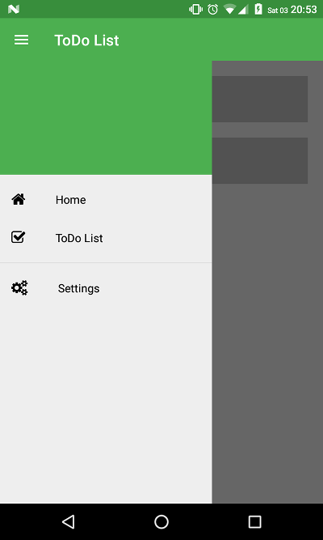

# NativeScript Ng2 Drawer Seed



## from the reference
Git ref: [nativescript-ng2-drawer-seed](https://github.com/ntrp/nativescript-ng2-drawer-seed)

Nativescript seed project with [nativescript-telerik-ui](https://www.npmjs.com/package/nativescript-telerik-ui) 
drawer support integrated and ready to be used.

To test the app just clone the repository and run:
```shell
$ npm install
$ tns run android
```
If already platform added
```shell
$ tns platform remove android
$ tns platform add android
$ tns run android
```
For livesync
```shell
$ tns livesync android --watch
```
